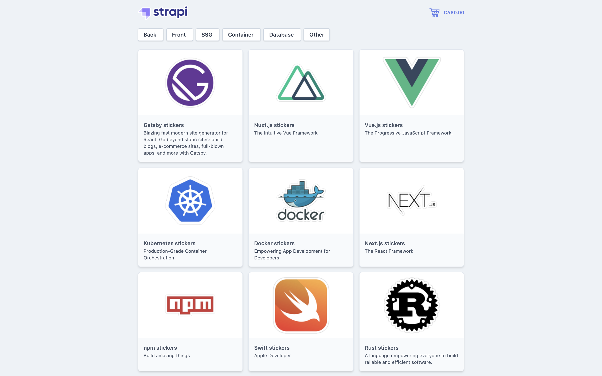

# Strapi Starter Next.js E-commerce

Next.js starter for creating a simple e-commerce website with Strapi.



This starter allows you to try Strapi with Next.js with the example of a simple e-commerce website where you can buy dev stickers. It is fully customizable and due to the fact that it is open source, fully open to contributions. So do not hesitate to add new features and report bugs!

## Features

- 1 Component
- 2 Collection types: Product, Category
- 27 Created products
- 6 Created categories
- Permissions set to `true` for product and category
- Responsive design using Tailwind css
- Slug system
- Publication system (draft & published)
- Role based access controls
- Payments handled with Snipcart

## Getting started

### Backend

Move to backend folder and run below commands

```
# Using NPM
npm install
npm run build
npm run dev (To start backend server locally)

```

The Strapi server will automatically start and import sample seed data.

### Frontend

Leave the Strapi backend running in the background. Open another terminal tab, and make sure you're in the `frontend` directory:

```bash
cd frontend
```

Then install dependencies and start the server:

```bash
# Using npm
npm install
npm run dev

```

The Next.js server will run here => [http://localhost:3000](http://localhost:3000)
